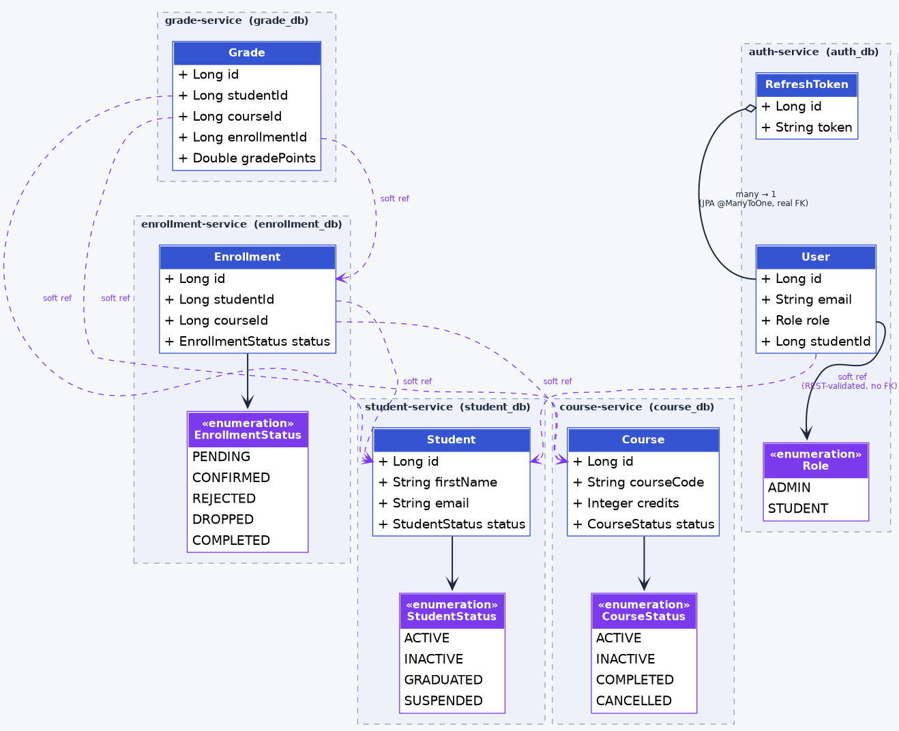

# StudentHub

A full-stack, microservices-based Student Management System built with
**Java 17 / Spring Boot 3** on the backend and **React 19 / Vite / Material UI**
on the frontend — covering authentication & role-based access control,
student records, a course catalog, enrollment workflows, and GPA/CGPA
calculation, all fronted by a single API gateway.

This was built incrementally in phases, each one fully working end-to-end
before the next was layered on, which is why the design favors clear
service boundaries and independently-owned databases over shortcuts.

---

## Architecture (HLD)


Six Spring Boot services, each with its own MySQL database (database-per-service),
sit behind a single Spring Cloud Gateway entry point. Services call each
other over plain REST — never by sharing a database — and every
inter-service call forwards the *original caller's own JWT* downstream
("pass-through auth"), so a service's ownership rules apply identically
whether it's called directly or through another service.

| Service              | Port | Responsibility                                      | Database       |
|-----------------------|------|--------------------------------------------------------|-----------------|
| `api-gateway`         | 9000 | Single entry point: routing, coarse JWT check, CORS    | —               |
| `auth-service`        | 8080 | Registration, login, JWT issuance/refresh, roles, users| `auth_db`       |
| `student-service`     | 8081 | Student profile CRUD, search, pagination                | `student_db`    |
| `course-service`      | 8083 | Course catalog: capacity, credits, semester, instructor | `course_db`     |
| `enrollment-service`  | 8082 | Enrollment lifecycle, capacity checks, duplicate prevention | `enrollment_db` |
| `grade-service`       | 8084 | Grade assignment (against a verified enrollment) + GPA/CGPA | `grade_db`      |

Every service **independently re-validates** the JWT it receives — the
gateway's check is defense in depth, not the sole security boundary. If a
request reached `student-service` directly (bypassing the gateway), it
would still be fully protected.

## Class Diagram (LLD)


---

## Tech Stack

**Backend**
- Java 17, Spring Boot 3.3.4, Spring Security 6, Spring Data JPA
- Spring Cloud Gateway (reactive) for the API gateway
- JWT (JJWT) for stateless access tokens + persisted, revocable refresh tokens
- BCrypt password hashing
- MySQL 8 (one schema per service)
- springdoc-openapi (Swagger UI) on every REST-exposing service
- Maven, Docker, Docker Compose
- Lombok, a shared `common-lib` module (DTOs, exceptions, JWT validation)

**Frontend**
- React 19, Vite 8
- Material UI (MUI) v9
- react-router-dom v7 (protected + role-based routes)
- axios with an automatic JWT-refresh interceptor
- notistack (toast notifications)

---

## Features

### Admin
- Dashboard with live counts (students, courses, enrollments, active courses)
- Full CRUD for students and the course catalog (capacity, credits,
  semester, instructor, department, status)
- Browse enrollment rosters by course; change enrollment status
- Assign/update grades against a specific enrollment
- Manage user accounts: assign roles (ADMIN/STUDENT), activate/deactivate

### Student
- Dashboard with CGPA, total credits, and course counts
- Browse active courses and self-enroll (capacity-checked server-side)
- View and drop their own enrollments
- View their own grades and a GPA-by-semester breakdown
- View and edit their own profile

### Platform
- Role-based access control enforced **at the service layer**, not just
  the UI — a STUDENT token literally cannot fetch another student's data,
  regardless of what the frontend does
- Stateless JWT access tokens (15 min) + persisted, revocable refresh
  tokens (7 days) with rotation on refresh
- A grade can never exist without a real, verified enrollment behind it
  (grade-service checks with enrollment-service before accepting one)
- Consistent JSON error shape across every service
  (`timestamp`, `status`, `error`, `message`, `path`, `validationErrors`)

---

## Project Structure

```
student-management-system/
├── docs/
│   └── architecture-diagram.svg
├── postman/
│   ├── Phase2-Gateway-Flow.postman_collection.json
│   └── Phase3-Courses-Grades.postman_collection.json
├── frontend/
│   └── student-management-ui/    React 19 + Vite + MUI SPA
└── backend/
    ├── common-lib/                Shared DTOs, exceptions, JWT validation (plain Maven jar)
    ├── api-gateway/                Spring Cloud Gateway
    ├── auth-service/
    ├── student-service/
    ├── course-service/
    ├── enrollment-service/
    ├── grade-service/
    └── docker-compose.yml
```

---
## Incremental Approach

- Phase 1: student-service,
enrollment-service,
auth-service (registration, login, JWT issuance, refresh tokens, BCrypt, role management),
common-lib module for DTOs/exceptions/JWT validation shared across every service.
- Phase 2: api-gateway (Spring Cloud Gateway) as the single entry point, and wired real JWT security into student-service/enrollment-service
- Phase 3: Split course-service out of enrollment-service entirely (its own DB, its own bounded context), grade-service (grade assignment gated on a real enrollment, GPA/CGPA calculation).
- Phase 4: Frontend. React 19 + Vite + MUI SPA, talking only to the gateway.

---

## Setup Instructions

### Prerequisites
- Java 17 JDK
- Maven (or an IDE that bundles it, e.g. IntelliJ)
- Node.js 18+ and npm
- MySQL 8 running locally **or** Docker + Docker Compose

### Option A — Docker Compose (backend, all at once)

```bash
cd backend
docker compose up --build
```

This starts 5 MySQL instances, all 6 Spring Boot services, and the
gateway. Then run the frontend separately (Docker Compose doesn't include
it, so you can iterate on it with hot reload):

```bash
cd ../frontend/student-management-ui
npm install
npm run dev
```

### Option B — Run everything manually

`common-lib` must be installed into your local Maven repo first, since
every backend service depends on it:

```bash
cd backend/common-lib
mvn clean install
```

Then, each in its own terminal (all need `DB_PASSWORD` set to your local
MySQL password):

```bash
cd backend/auth-service        && export DB_PASSWORD=... && mvn spring-boot:run   # :8080
cd backend/student-service     && export DB_PASSWORD=... && mvn spring-boot:run   # :8081
cd backend/enrollment-service  && export DB_PASSWORD=... && mvn spring-boot:run   # :8082
cd backend/course-service      && export DB_PASSWORD=... && mvn spring-boot:run   # :8083
cd backend/grade-service       && export DB_PASSWORD=... && mvn spring-boot:run   # :8084
cd backend/api-gateway         && mvn spring-boot:run                              # :9000

cd frontend/student-management-ui && npm install && npm run dev                    # :5173
```

If using IntelliJ: open `common-lib`, run `mvn install` on it via the
Maven tool window first, then open/run the other modules normally with
`DB_PASSWORD` set in each Run Configuration's environment variables.

### First-time setup: creating an admin

Self-registration (`POST /api/v1/auth/register`) always creates a
**STUDENT** account by design — there's no self-service admin creation.
To get your first admin:
1. Register normally as a student.
2. Connect to `auth_db` and update that user's row: `UPDATE users SET role='ADMIN' WHERE email='...';`
3. Log in again to get a fresh token with the ADMIN role.

---

## API Documentation (Swagger)

Each REST-exposing service has its own Swagger UI, reachable **directly**
on its own port (the gateway routes `/api/v1/**` traffic only, not docs
routes):

| Service              | Swagger UI                                      |
|-----------------------|---------------------------------------------------|
| `auth-service`        | http://localhost:8080/swagger-ui.html             |
| `student-service`     | http://localhost:8081/swagger-ui.html             |
| `enrollment-service`  | http://localhost:8082/swagger-ui.html             |
| `course-service`      | http://localhost:8083/swagger-ui.html             |
| `grade-service`       | http://localhost:8084/swagger-ui.html             |

Note: Swagger UI's own "Try it out" won't have a token attached
automatically — grab an access token from `POST /auth/login` first and
paste it into the "Authorize" button (`Bearer <token>`).

---

## Postman

Two collections are included under `postman/`, both routed through the
gateway on port 9000:
- **Phase2-Gateway-Flow** — register/login/refresh, admin promoting a
  user, student vs admin ownership checks on students/courses/enrollments
- **Phase3-Courses-Grades** — richer course fields, grade assignment by
  enrollment id, GPA/CGPA retrieval, and negative tests (student blocked
  from creating a course, admin blocked from grading a fake enrollment)

---
